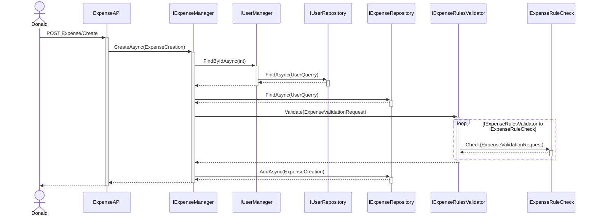
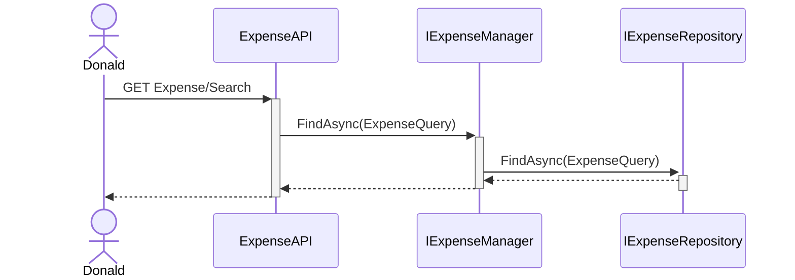
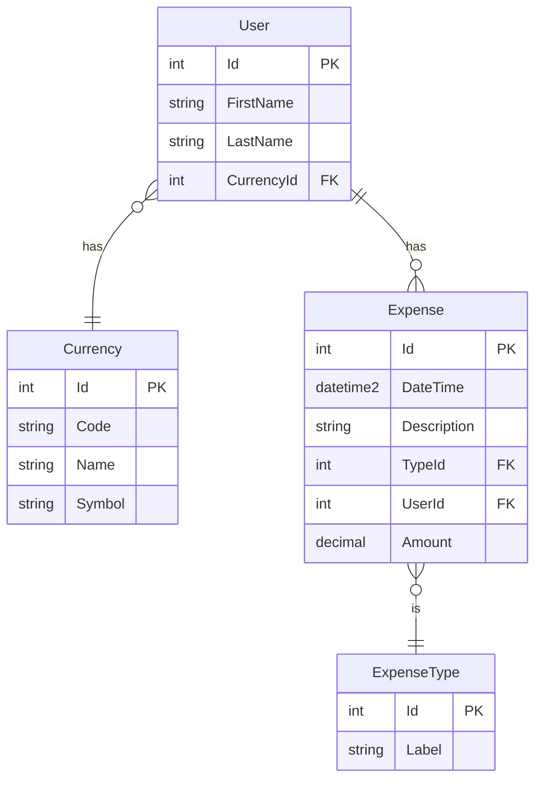

# Wallet System Expense Management API

## Table of Contents
- [Introduction](#introduction)
- [Sequence diagrams](#sequence-diagrams)
- [Entity Relationship Diagram](#entity-relationship-diagram)

## Introduction
This repository contains the source code of small wallet system.

## Sequence diagrams
### Create Expense

### Search Expense

## Entity Relationship Diagram

